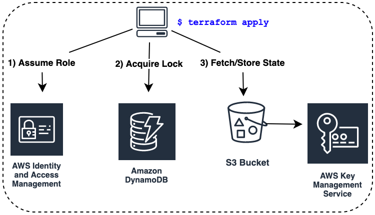

## Overview

- A **backend** in Terraform determines how **state** is loaded and how operations like `terraform plan` and `terraform apply` are executed.
- Besides storing state, **backends** can also be configured for:
  - Synchronizing access to **state** files via locking
  - Storing sensitive information securely
  - Keeping a history of all state file revisions
  - Determining how operations are implemented
- The **state** files are stored in some location and there’s a built-in way to synchronize access to the state file.
- Most backends support encryption at rest and versioning of **state** files.
- There’re also **enhanced** and **standard backends**.
- **Enhanced backends** are relatively new and allow you to do sophisticated things like run CLI operations on a remote machine and stream the results back to your local terminal.
- They also allow you to read variables and environment variables stored on the remote machine, so there’s no longer a need for a variables definition (`terraform.tfvars`) file.
- The most popular standard backend is the **S3** remote backend for AWS.

<p align="center">
  
</p>

- Every Terraform client that shares the same **S3 backend** will fetch and store their **state** from a common **S3 bucket**.
- The **state** file itself is encrypted at rest using **KMS**.
- Access is controlled by a least privileged **IAM policy** and synchronized with a **DynamoDB** locking mechanism.


### Developing an S3 Backend Module

- Our goal is to architect a module that can eventually be used to deploy a production ready **S3 backend**.
- There are three input variables (`assume_role_account_id`, `force_destroy_s3`, `namespace`) and one output value (`config` that has all the information required for other workspaces to initialize themselves against the S3 backend).
- There are four distinct components required to deploy an **S3 backend**. These are:
  - DynamoDB table
    - For locking
  - S3 Bucket and KMS Key
    - For state storage and encryption at rest
  - IAM Least Privileged Role
    - Other AWS accounts can assume a role to this account and perform deployments against the S3 backend
  - Miscellaneous housekeeping resources.

### Flat Module Structure

- Flat modules (as opposed to nested modules) are when you organize your code by creating lots of little `.tf` files within a single monolithic module.
- Each file in the module contains all the code for deploying an individual component, which would otherwise be broken out into its own module.
- The primary advantage of flat module structures over nested modules is reduced boilerplate, and easier codebase navigation.
- For example, instead of creating a fully-fledged module for IAM resources, that code could be put into a file name `iam.tf`.


### Writing the Code

- Start by creating 6 files: `variables.tf`, `main.tf`, `iam.tf`, `outputs.tf`, `versions.tf` 

```json
// variables.tf
variable "namespace" {
    description = "The project namespace to use for unique resource naming"
    default = "s3backend"
    type = string
}
variable "principal_arn" {
    description = "AWS principal arn allowed to assume the IAM role"
    default = null
    type = string
}
variable "force_destroy_state" {
    description = "Force destroy the s3 bucket containing state files?"
    default = true
    type = bool
}
```

- The complete code for provisioning the **S3 bucket**, **KMS key**, and **DynamoDB** table is shown below:

```json
data "aws_region" "current" {} // 1

resource "random_string" "rand" { 
    length  = 24
    special = false
    upper   = false
}

locals {
    namespace = substr(join("-", [var.namespace, random_string.rand.result]), 0, 24)
}
resource "aws_resourcegroups_group" "resourcegroups_group" {
    name = "${local.namespace}-group"

    resource_query { // 2
        query = <<-JSON
        {
            "ResourceTypeFilters": [
                "AWS::AllSupported"
            ],
            "TagFilters": [
            {
                "Key": "ResourceGroup",
                "Values": ["${local.namespace}"]
            }
        ] 
    }
    JSON
    }
}

resource "aws_kms_key" "kms_key" { 
    tags = {
        ResourceGroup = local.namespace
    }
}

resource "aws_s3_bucket" "s3_bucket" {
    bucket = "${local.namespace}-state-bucket"
    force_destroy = var.force_destroy_state

    versioning {
        enabled = true
    }

    server_side_encryption_configuration {
        rule {
            apply_server_side_encryption_by_default {
                sse_algorithm = "aws:kms"
                kms_master_key_id = aws_kms_key.kms_key.arn
            }
        }
    }

    tags = {
        ResourceGroup = local.namespace
    }
}

resource "aws_dynamodb_table" "dynamodb_table" {
    name = "${local.namespace}-state-lock" hash_key = "LockID"
    billing_mode = "PAY_PER_REQUEST" // 3
    attribute { 
        name = "LockID"
        type = "S"
    }
    tags = {
        ResourceGroup = local.namespace
    }
}
```

- **1** - This will be used to set an output value
- **2** - Populate the resource group based on a tagging schema
- **3** - Provision a serverless database for state locking


- Next is the code for `iam.tf`.
- This particular code creates a least priviliged IAM role that another AWS account can assume to deploy against the S3 remote backend.
- To clarify: you would be expected to have a single dedicated AWS account for housing all S3 remote backends that your company manages, and then have other AWS accounts **assume a role** into this account for least priviliged access.
- Deployment users would only have priviliges to utilize the **S3 backend/state** files they are authorized for.
- In this example, the **IAM role** we declare grants permissions to store an **S3 object** from a specific **S3 bucket**, and get/delete records from the **DynamoDB table**.

```json
// iam.tf
data "aws_caller_identity" "current" {}

locals {
    principal_arn = var.principal_arn != null ? var.principal_arn : data.aws_caller_identity.current.arn
}

resource "aws_iam_role" "iam_role" {
    name = "${local.namespace}-tf-assume-role"
    assume_role_policy = <<-EOF
    {
        "Version": "2012-10-17",
        "Statement": [
        {
            "Action": "sts:AssumeRole",
            "Principal": {
                "AWS": "${local.principal_arn}"
            },
            "Effect": "Allow"
        }
    ]   
}
EOF

tags = {
    ResourceGroup = local.namespace }
}

data "aws_iam_policy_document" "policy_doc" {
    statement {
        actions = [
            "s3:ListBucket",
        ]

        resources = [
            aws_s3_bucket.s3_bucket.arn
        ]
    }
    statement {
        actions = ["s3:GetObject", "s3:PutObject"]
        resources = [
            "${aws_s3_bucket.s3_bucket.arn}/*",
        ]
    }
    statement {
        actions = [
            "dynamodb:GetItem", 
            "dynamodb:PutItem", 
            "dynamodb:DeleteItem"
        ]

        resources = [aws_dynamodb_table.dynamodb_table.arn]
    }
}

resource "aws_iam_policy" "iam_policy" {
    name = "${local.namespace}-tf-policy"
    path = "/"
    policy = data.aws_iam_policy_document.policy_doc.json
}

resource "aws_iam_role_policy_attachment" "policy_attach" {
    role = aws_iam_role.iam_role.name
    policy_arn = aws_iam_policy.iam_policy.arn
}
```

- There are three pieces of information that a workspace will need to be able to initialize and deploy against the **S3 backend**. These are:
  - The name of the **bucket**.
  - The **region** the S3 backend is deployed to
  - The **arn of the role** that can be assumed.
- Since this isn’t the **root module**, the outputs will need be bubbled up in order to be visible after
a `terraform apply`. 

```json
// outputs.tf
output "config" {
    value = {
        bucket          = aws_s3_bucket.s3_bucket
        region          = data.aws_region.current.name
        role_arn        = aws_iam_role.iam_role.arn
        dynamodb_table  = aws_dynamodb_table.dynamodb_table.name
    }
}
```

- Even though we don’t declare providers, it’s still a good idea to version lock modules, so that anyone consuming the module will know whether they are using compatible providers or not.

```json
terraform {
    required_version = "~> 0.12"
    required_providers {
        aws = "~> 2.19"
        random = "~> 2.1"
    }
}
```

## Sharing Modules

- In this section, I’ll show you how to publish and source a module in two different ways:
  - From **GitHub**, then
  - From the **Terraform Module Registry**.

### GitHub